# ZipLine
filter app contains APIs which will allow you to perform CRUD operations on your MongoDB Clusters
<hr>
<br>

## Supported Features
- [x] CREATE a single product
- [x] CREATE multiple products
- [x] RETRIEVE a single product
- [x] RETRIEVE multiple products
- [x] UPDATE a single product
- [x] UPDATE multiple products
- [x] DELETE a single product
- [x] DELETE multiple products
- [x] Detailed documentation
- [x] Support for pagination
- [x] Versioning flexibility
- [ ] Multiple operations in a single query
- [ ] Extensive logging
- [x] Filter while fetching and deleting multiple objects
- [ ] Swagger UI
<br>
<b>*Object schema checking feature is not added to take advantage of NoSQL's schema indepenance*</b>
<hr>
<br>

## Installation
### Dependencies
1. [Docker Compose](https://docs.docker.com/compose/)
2. Internet connection to connect to Cluster

### Steps to run
```
git clone https://github.com/Udit107710/ZipLine.git
```
```
cd ZipLine
```
```
docker-compose up
```
<hr>
<br>

## Endpoints
<br>

**PATCH will replace particular fields whereas PUT will replace whole object**

### For Single Instance Resource Handling

|URL|Method|Parameters|Response|
|---|---|---|---|
|api/v1/product/<product_id>| GET |<ol><li> product_id (in URL)</li></ol>| [Product (with ID)](#product-with-id)|
|api/v1/product/ | POST |<ol><li> [Product](#product) (in body)</li></ol>| [Message](#create-message)|
|api/v1/product/<product_id>| PATCH |<ol><li> product_id (in URL)</li><li>[Product](#product) (in body)</li></ol>| [Update Message](#update-message)|
|api/v1/product/<product_id>| PUT |<ol><li> product_id (in URL)</li><li>[Product](#product) (in body)</li></ol>| [Update Message](#update-message)|
|api/v1/product/<product_id>| DELETE | <ol><li> product_id (in URL)</li></ol> |[Delete Message](#delete-message)|
### For Multiple Instnace Resource Handling

|URL|Method|Parameters|Response|
|---|---|---|---|
|api/v1/products | GET |<ol><li> skip<sup>1</sup> (in query)</li><li> limit<sup>2</sup> (in query)</li><li>Array of [filter](#edit-multiple-details) (in body)</li></ol>| [Products with details](##product-with-details)|
|api/v1/products | POST |<ol><li> Array of [Product](#product) (in body)</li></ol>| [Bulk Update Message](#bulk-write-message)|
|api/v1/products | PATCH |<ol><li> Array of [filter](#edit-multiple-details) (in body)</li></ol>| [Bulk Update Message](#bulk-write-message)|
|api/v1/products | PUT |<ol><li> Array of [filter](#edit-multiple-details) (in body)</li></ol>| [Bulk Update Message](#bulk-write-message)|
|api/v1/products | DELETE |<ol><li> Array of [filter](#edit-multiple-details) (in body)</li></ol>| [Bulk Update Message](#bulk-write-message)|

1: How many products to skip from start
2: How many products to fetch
<hr>
<br>

## Examples

Find postman collection [here](https://www.getpostman.com/collections/801dba9637c62c737893)

<div class="postman-run-button"
data-postman-action="collection/import"
data-postman-var-1="801dba9637c62c737893"></div>
<script type="text/javascript">
  (function (p,o,s,t,m,a,n) {
    !p[s] && (p[s] = function () { (p[t] || (p[t] = [])).push(arguments); });
    !o.getElementById(s+t) && o.getElementsByTagName("head")[0].appendChild((
      (n = o.createElement("script")),
      (n.id = s+t), (n.async = 1), (n.src = m), n
    ));
  }(window, document, "_pm", "PostmanRunObject", "https://run.pstmn.io/button.js"));
</script>

### List with 5 objects skipped and 1 fetched
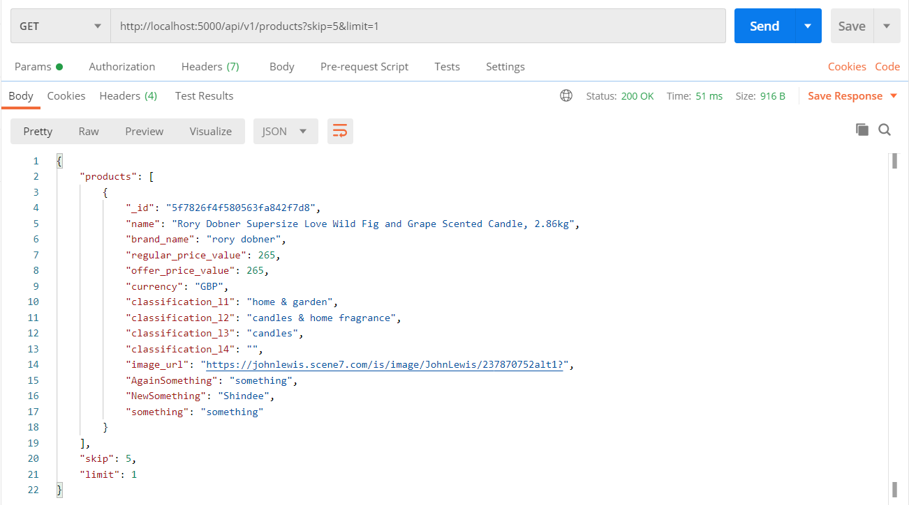
<br>
<br>

### List with 5 objects skipped and 2 fetched
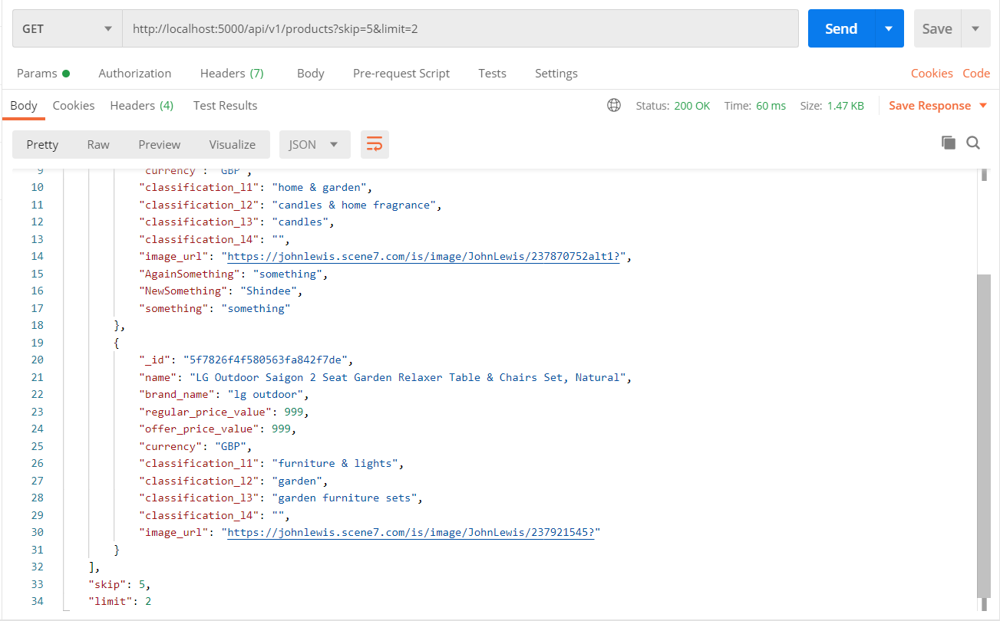
<br>
<br>

### List with 5 objects filtered by classification_l1
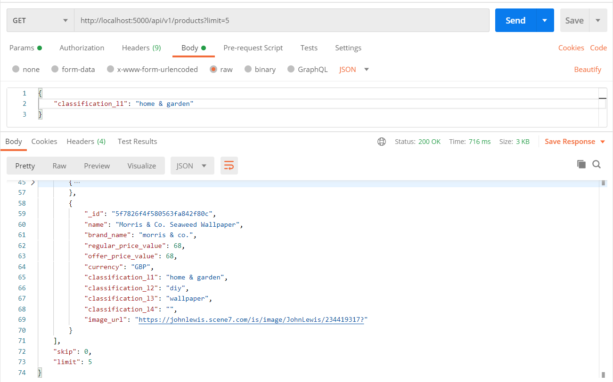
<br>
<br>

### Created 3 objects
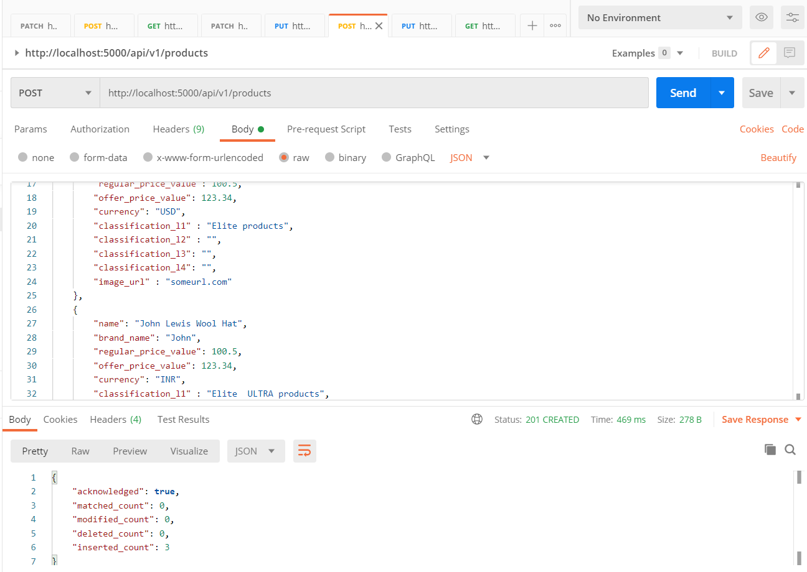
<br>
<br>

### Replaced 3 objects
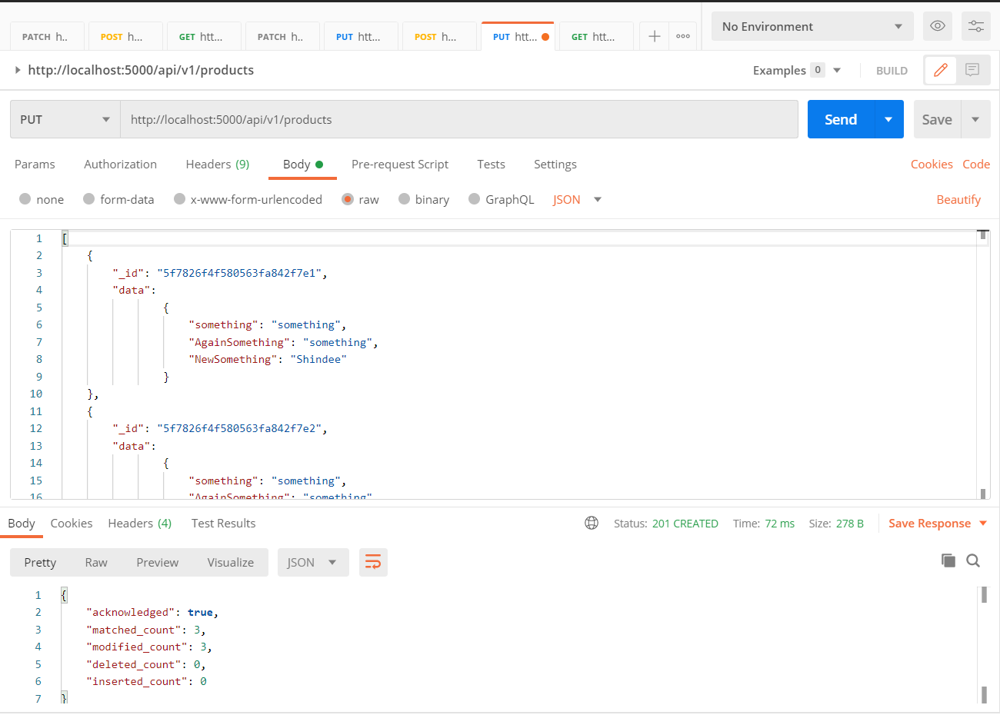
<br>
<br>

### Appended data to three objects
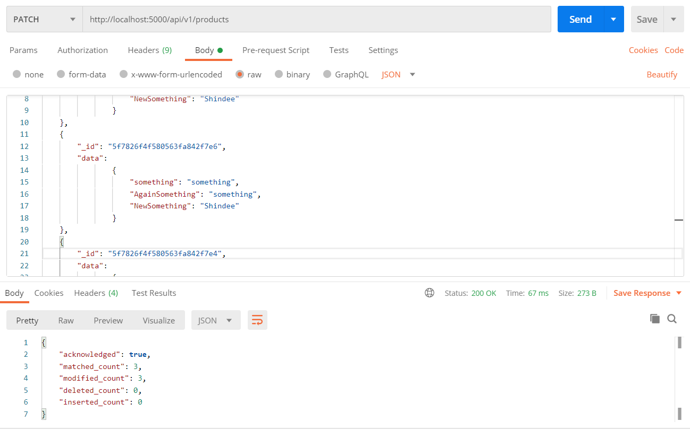
<br>
<br>

### Delted 623 objects
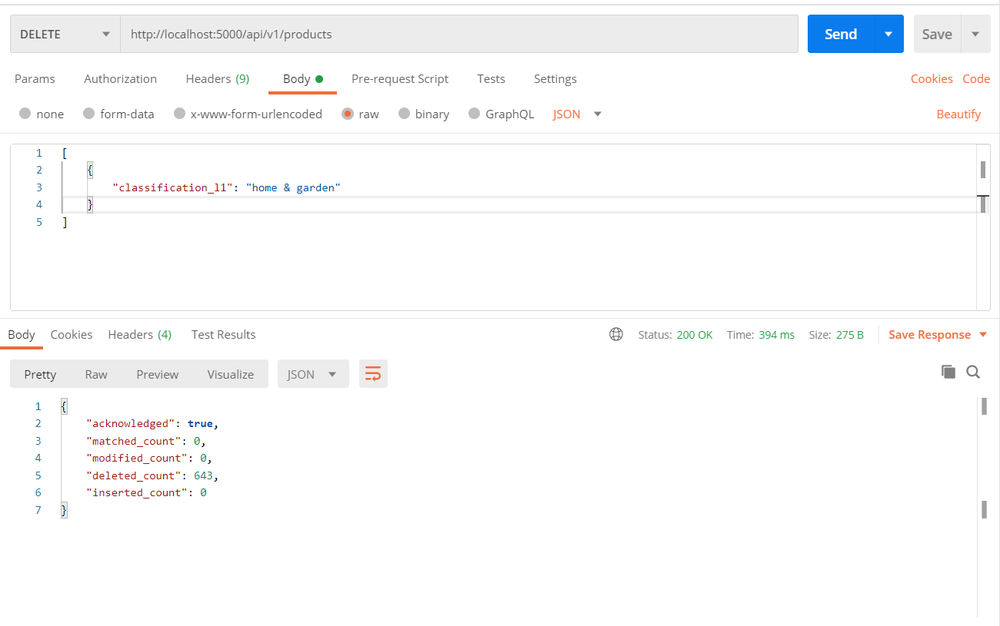
<br>
<br>

### Get a single object
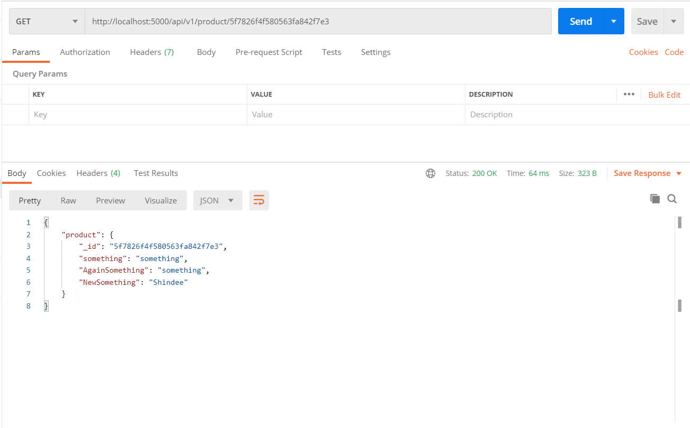
<br>
<br>

### Created a single object
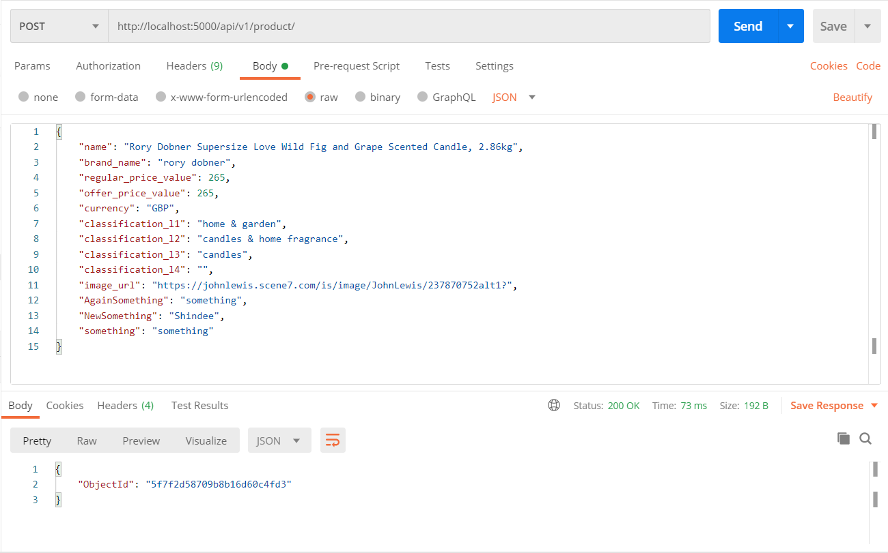
<br>
<br>

### Appended data to a single object

<br>
<br>

### Replaced a single object
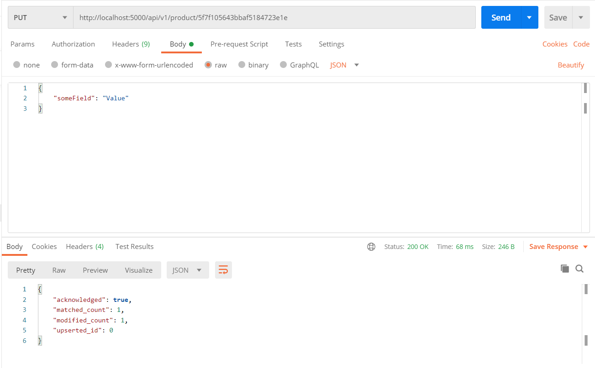
<br>
<br>

### Deleted Sigle element by ID
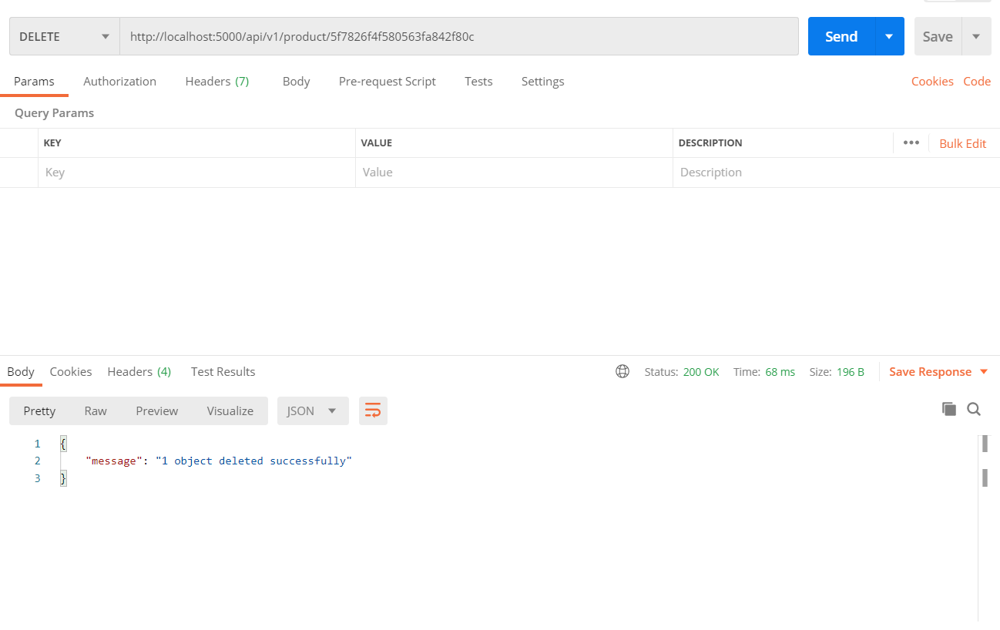
<br>
<br>

## Object Schemas

### Product
```
{
    'name':   <string>,
    'brand_name':   <string>,
    'regular_price_value':   <float>,
    'offer_price_value':   <float>,
    'currency':   <string>,
    'classification_l1':  <string>v,
    'classification_l2':   <string>,
    'classification_l3':   <string>,
    'classification_l4':   <string>,
    'image_url':   <string>,
}
```

### Product With Id
```
{
    '_id': <string>,
    'name':   <string>,
    'brand_name':   <string>,
    'regular_price_value':   <float>,
    'offer_price_value':   <float>,
    'currency':   <string>,
    'classification_l1':  <string>v,
    'classification_l2':   <string>,
    'classification_l3':   <string>,
    'classification_l4':   <string>,
    'image_url':   <string>,
}
```

### Create Message
```
{
    "ObjectId": <string>
}
```

### Update Message
```
{
    "acknowledged": <bool>,
    "matched_count": <int>,
    "modified_count": <int>,
    "upserted_id": <int>,
}
```

### Bulk Write Message
```
{
    "acknowledged": <bool>,
    "matched_count": <int>,
    "modified_count": <int>,
    "deleted_count": <int>,
    "inserted_count": <int>,
}
```

### Products with details
```
{
    "products": [
        ...
        {
            '_id': <string>,
            'name':   <string>,
            'brand_name':   <string>,
            'regular_price_value':   <float>,
            'offer_price_value':   <float>,
            'currency':   <string>,
            'classification_l1':  <string>v,
            'classification_l2':   <string>,
            'classification_l3':   <string>,
            'classification_l4':   <string>,
            'image_url':   <string>,
        },
        ...
    ]
    "skip": <int>,
    "limit": <int>
}
```

### Edit Multiple Details
```
[
    ...
    {
		"_id": <string>,
		"data":
				{
                    ...
					<string>: <string>,
                    ...
				}
	}
    ...
]
```

### Delete Message
```
{
    "message": "<COUNT> object deleted successfully"
}
```